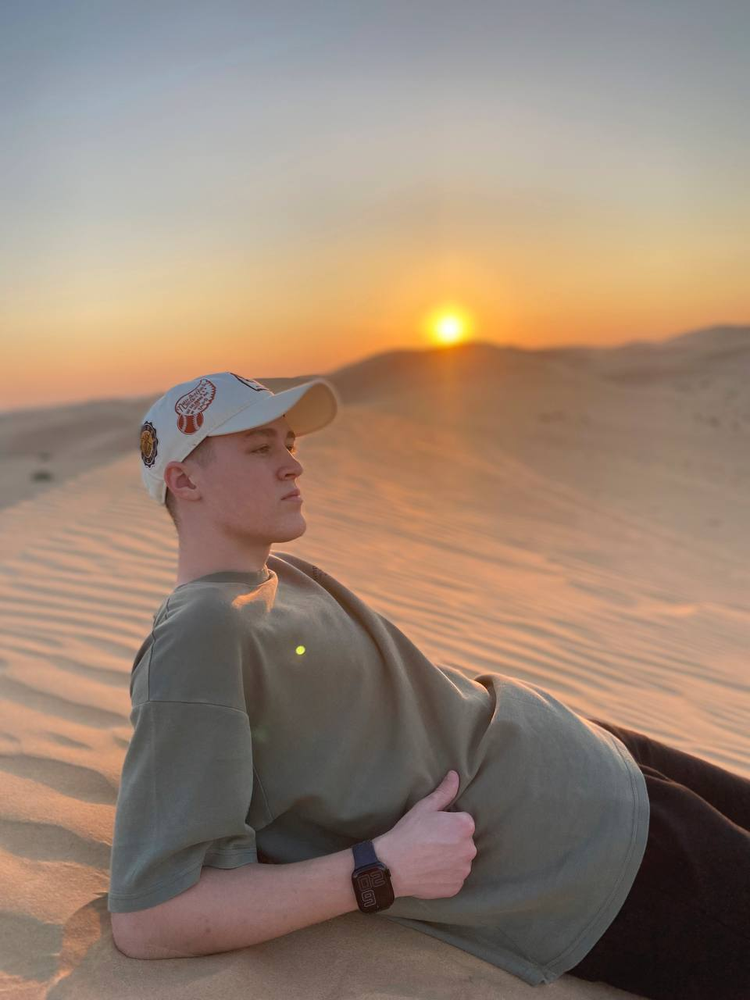

<h1 align="center">medCare - application for finding medications!</h1>

## Welcome and about
<h2>
  Hi there <a href="https://github.com/kaifarikman" target="_blank">Amir</a> and <a href="https://github.com/firstinpython" target="_blank">Tagir</a>
</h2>

## Yandex Lyceum participants with a PyQt5 project from Russia 🇷🇺

**MedCare is an application with information about medications, their purpose, cost, location in pharmacies and analogues.** <br>
**The target audience is health-conscious patients, doctors, pharmacists and representatives of pharmaceutical companies.**


## Main functions

- **User registration in the application**
- **Sending a unique confirmation code by email**
- **Creating child classes for the main application**
- **Data parsing**
- **Working with databases (.csv, .db)**
  
## Technical requirements

***This application can run safely on Windows, Linux, macOS platforms, but only on a light theme...with a black problem***<br>

<p align="center"></p>

***In order for the application to launch, you need an Internet connection! Nothing will work without him(***

## Support and communication with developers

### Application developers on PyQt5. 

<p align="center"></p>

*****Amir*** decided to write the entire Backend of the application, writing various excellent working functions).**

<p align="center"></p>

*****Tagir*** - made a sweet and beautiful candy from tasteless caramel, completely designing it in QtDisigner and choosing colors together with the designer.**

**They are very tired, so you can support them in telegram:**

<p>
  Their data is <a href="https://t.me/king_offkaif">Knyazev Amir</a> and <a href="https://t.me/player_first">Nurtdinov Tagir</a>
</p>

### Creator of the idea

<p align="center"></p>
Raul - is the mastermind behind this wonderful application that you use to find medicines. Have fun using our brainchild!

### Artist
<p align="center"></p>

Shakira - a genius of design and more, she not only came up with a thousand and one ideas for other projects, but also kindly helped her friends!

### Some facts

***Yes, yes. The application takes a very long time to launch, although we optimized it as best we could.. It’s just Python and we need to come to terms with it all.. Sorry friends, we tried our best***<br>

***When we launch the application, we already have a database with medications, which we took during initialization (and we took only 3 categories. If you want to take more, study parsing_site.py). Understand us, since optimization in OOP is very “fast”, so also parsing... But parsing is written coolly)***

## Project setup

```
pip install PyQt5
pip install requests
pip install bs4
pip install numpy
pip install pandas
pip install urllib3
python3 main.py
```
